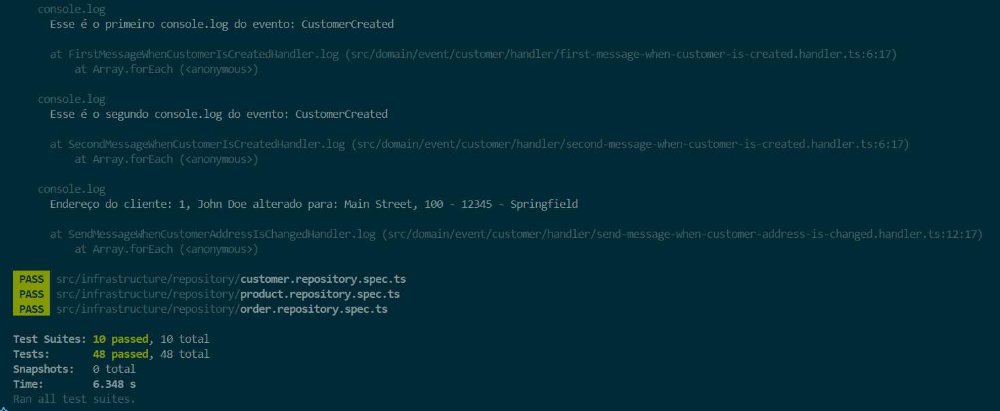

# DDD Order Repository Implementation

## Description
This project is part of the **Full Cycle 3.0** course challenge. The goal is to implement **two domain events** for the `Customer` aggregate, ensuring that the events are triggered and handled correctly by their respective handlers. The implementation is done in **TypeScript** and follows **Domain-Driven Design (DDD)** principles. 

## Challenge Requirements
- Implement domain events for the `Customer` aggregate.
- Create handlers that execute the required actions when the events are triggered.
- Ensure that all test cases pass successfully before submission.
- The project is built using **TypeScript** and follows **Domain-Driven Design (DDD)** principles.

## Installation & Setup

###
Cloning the Repository

To get started, clone the repository and navigate to the project directory:
```sh
git clone https://github.com/LuisGaravaso/DDD-DomainEvents.git
```

### Prerequisites
Ensure you have the following installed on your machine:
- [Node.js](https://nodejs.org/en/download) (latest LTS version recommended)
- [npm](https://www.npmjs.com/) (included with Node.js)

### Install Dependencies
Run the following command to install the required dependencies:
```sh
npm install
```
After downloading the packages the folder `node_modules` should appear.

## Running Tests
To execute all unit tests, use the following command:
```sh
npm test
```
All tests should pass as follows.
**Note: you should also see the console logs from the events dispatched**



## DDD Concepts
This project follows **Domain-Driven Design (DDD)** principles, structured around key concepts:

### Entity
Entities are objects with a distinct identity that persists over time. They encapsulate core business rules and behaviors. Examples in this project include:
- `Address`
- `Customer`
- `Order`
- `OrderItem` 
- `Product`

### Service
Services encapsulate domain logic that doesn’t naturally fit into an entity. They operate on multiple entities and provide business logic for complex operations. Examples include:
- `OrderService`
- `ProductService`

### Repository
Repositories provide an abstraction layer between domain objects and the persistence mechanism. They handle operations such as storing, retrieving, and updating domain entities. Examples include:
- `CustomerRepository`
- `OrderRepository`
- `ProductRepository`


## Project Structure
The project follows a structured **DDD (Domain-Driven Design)** approach:
```
/src
│── domain/          # Core business logic
│   ├── entity/      # Domain entities (Customer, Order, Product, etc.)
│   ├── event/       # Domain events
│   │   ├── @shared/  #Events Implementations and Interfaces
│   │   │   ├── event.interface.ts
│   │   │   ├── event.handler.interface.ts
│   │   │   ├── event.dispatcher.ts
│   │   │   ├── event.dispatcher.interface.ts
│   │   ├── customer/ # Events related to the Customer Aggregate and Their Handlers
│   │   │   ├── customer-created.event.ts 
│   │   │   ├── customer-address-changed.event.ts
│   │   │   ├── handler/
│   │   │   │   ├── first-message-when-customer-is-created.handler.ts
│   │   │   │   ├── second-message-when-customer-is-created.handler.ts
│   │   │   │   ├── send-message-when-customer-address-is-changed.handler.ts
│   │   ├── product/ # Events related to the Product Aggregate and Their Handlers
│   │   │   ├── product-changed.event.ts
│   │   │   ├── handler/
│   │   │   │   ├── send-email-when-product-is-created.handler.ts
│   │   ├── tests/ # Events related to the Product Aggregate and Their Handlers
│   │   │   ├── event.dispatcher.customer.events.spec.ts #Tests Related to the Customer Aggregate Events
│   │   │   ├── event.dispatcher.product.ts #Tests Related to the Product Aggregate Events
│   ├── repository/  # Repository interfaces
│   ├── service/     # Business logic services
│── infrastructure/  # Database and persistence logic
│   ├── db/          # Sequelize database models
│   ├── repository/  # Implementations of repository interfaces
```
**NOTE: Only the main folders for this challenge are expanded**

## Database
- This project uses **SQLite** as an in-memory database for testing purposes.
- No additional database setup is required.

## Test Coverage Summary
### `event.dispatcher.customer.events.spec.ts`
- Validates the events related to a `Customer`.
- Tests validate user creation and address change.
- The events tested where `CustomerCreatedEvent` and `CustomerAddressChangedEvent`

### `event.dispatcher.product.events.spec.ts`
- Validates the events related to a `Product`.
- Tests validate product creation and notification.
- The event tested was `ProductCreated`

### Other tests
- They were implemented in the previous challenge.
- Information on them [available here](https://github.com/LuisGaravaso/desafios-fullcycle/tree/main/FC3-DDD-OrderRepository)

